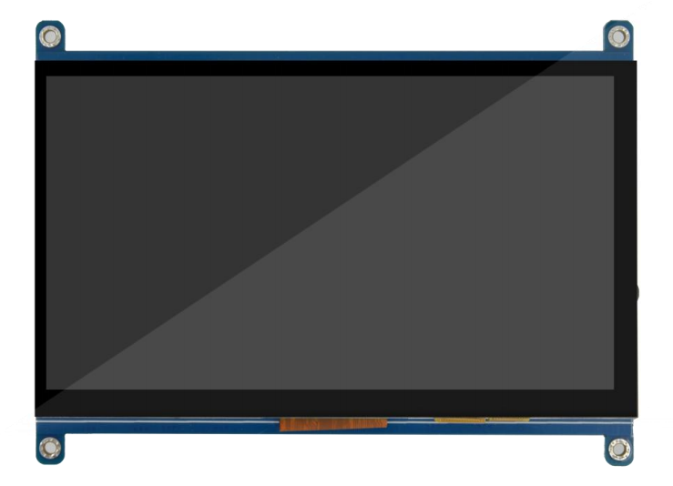
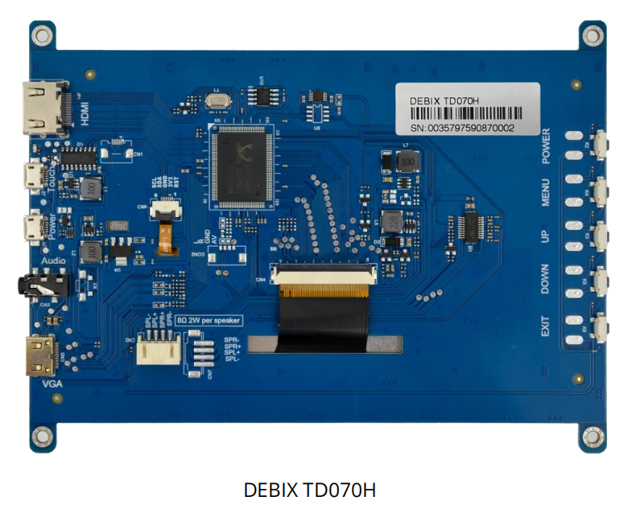
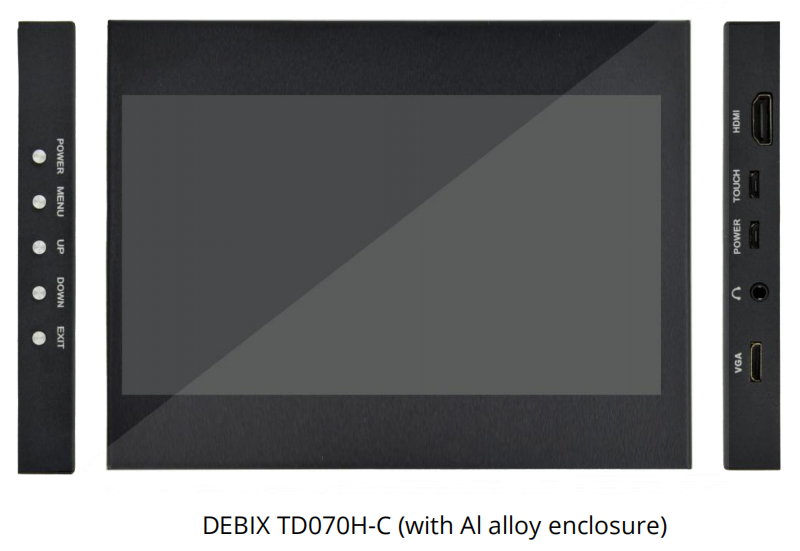

# DEBIX TD070H
 

## Overview
DEBIX TD070H is a 7-inch touch screen HDMI LCD monitor with 1024 x 600 resolution. The LCD monitor supports VGA and HDMI video signal input, power amplifier speaker and headphone output, touch operation, and remote control function.

## Main Features:
- 7.0” 1024 x 600 display size
- VGA and HDMI video signal input
- Touch operation
- Power amplifier speaker and headphone output
- Remote control function
- No-signal automatic power off function

## Compatibility:
Compatible with DEBIX series computers with HDMI ports

## Specification:
| DEBIX TD070H |  |
|--------------|--|
| LCD Size     | 7 inches (Diagonal) |
| Resolution   | 1024 x 600 |
| Active Area  | 154.21mm x 85.92mm |
| Outline Dimension (DEBIX TD070H-C) | 170.00mm x 131.00mm x 17.00mm |
| Touch Interface | 1 x Micro USB |
| Optional Function | (1) Power amplifier speaker   (2) Remote control function |
| Operating Temp. | -10℃~60℃ |
| Storage Temp. | -20℃~70℃ |
| Operating Humidity | 90%RH (no condensation) |
| Input Voltage | DC 5V |
| Net Weight (DEBIX TD070H) | 214g (±0.5g) |
| Net Weight (DEBIX TD070H-C) | 510g (±0.5g) |
| Gross Weight (DEBIX TD070H-C) | 841g (±0.5g) |

  
***Notice:***  *The aluminum alloy enclosure is optional.*

## Contact Us
- **Headquarters**: DEBIX Technology Inc., 8345 Gold River Ct., Las Vegas, NV 89113, USA  
- **Factory**: 5-6/F., East Zone, Shunheda A2 Building, Liqxiandong Industrial Park, XiLi, Nanshan Dist., Shenzhen, China  
- **Email**: info@debix.io  
- **Website**: [www.debix.io](https://www.debix.io)  
- **Community**: [Discord](https://discord.com/invite/adaHHaDkH2)